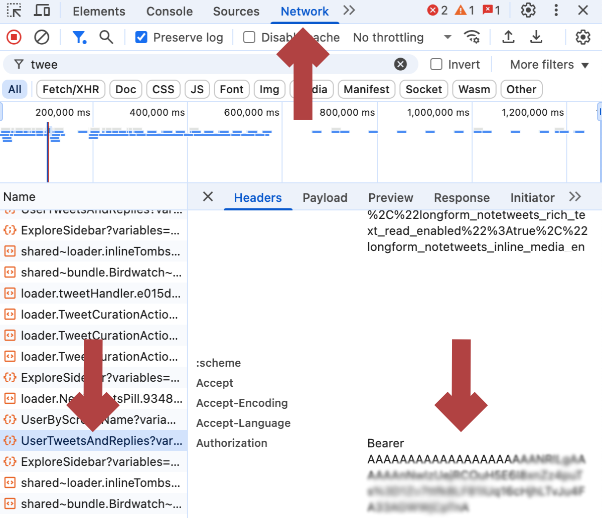
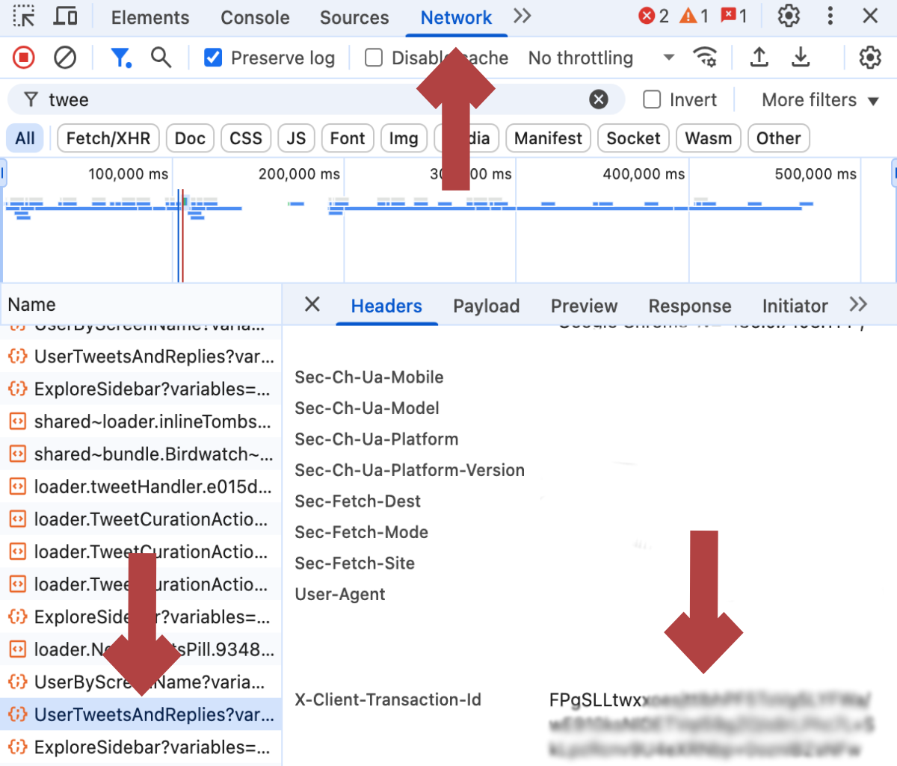

# XDeleter 🗑️

[](https://en.wikipedia.org/wiki/Brendan_Eich) [](https://github.com/ajwdd/XDeleter/stargazers) [](https://github.com/ajwdd/XDeleter) [](https://opensource.org/licenses/MIT) [](https://github.com/ajwdd/XDeleter/activity)

Want to rebrand? Made some bad decisions? Change your position?

No matter your need XDeleter is the perfect fit.

## 🔧 Features

- <u>Batch Removal</u>: Rapid tweet deletion/unretweeting.
- <u>User-Friendly</u>: Includes a simple to use UI and saves Bearer Token, usernname, and Tweet IDs to ignore for future use.

## 📜 Instructions

1.  Open the browser's console:

    - Linux, Windows, ChromeOS: <kbd>Ctrl</kbd> + <kbd>Shift</kbd> + <kbd>J</kbd>
    - macOS: <kbd>Cmd</kbd> + <kbd>Option</kbd> + <kbd>J</kbd>

2.  Navigate to your profile's Replies page: https://www.x.com/yourusername/with_replies.
   
3.  Copy the entirety of `XDeleter.js` and paste into the console, press <kbd>Enter.

4.  Locate Bearer Token.

    

5.  Locate Client ID.

    

6.  Enter username.

7.  Select options.

8.  Click start.


## 💾 Script:

      ```js
      // __  ______       _      _
      // \ \/ /  _ \  ___| | ___| |_ ___ _ __
      //  \  /| | | |/ _ \ |/ _ \ __/ _ \ '__|
      //  /  \| |_| |  __/ |  __/ ||  __/ |
      // /_/\_\____/ \___|_|\___|\__\___|_|
      // v1.0.0   https://github.com/ajwdd

      // DON'T EDIT THIS FILE DIRECTLY!
      (function () {
        let authorization = "";
        let client_tid = "";
        let username = "";
        let csrf_token = "";
        let user_id = "";
        let ua = "";
        let language_code = "";

        let delete_options = {
          unretweet: true,
          do_not_remove_pinned_tweet: true,
          delete_message_with_url_only: false,
          delete_specific_ids_only: [""],
          match_any_keywords: [""],
          tweets_to_ignore: [],
          after_date: new Date("1900-01-01"),
          before_date: new Date("2100-01-01"),
        };

        const random_resource = "dGUkXXo_EoCL_NimyHrJ-Q";
        const delete_tweet_graphql_id = "VaenaVgh5q5ih7kvyVjgtg";
        const delete_tweet_transaction_id =
          "LuSa1GYxAMxWEugf+FtQ/wjCAUkipMAU3jpjkil3ujj7oq6munDCtNaMaFmZ8bcm7CaNvi4GIXj32jp7q32nZU8zc5CyLw";

        let tweets_to_delete = [];
        let stop_signal = false;
        let is_processing = false;

        // Local Storage Keys
        const IGNORE_IDS_STORAGE_KEY = "xdeleter_ignore_ids";
        const BEARER_TOKEN_STORAGE_KEY = "xdeleter_bearer_token";
        const USERNAME_STORAGE_KEY = "xdeleter_username"; // New key for Username

        let uiContainer,
          logAreaElement,
          authTokenInput,
          clientIdInput,
          usernameInput,
          unretweetCheckbox,
          keepPinnedCheckbox,
          urlOnlyCheckbox,
          keywordsInput,
          ignoreIdsInput,
          afterDateInput,
          beforeDateInput,
          specificIdsInput,
          startButton,
          stopButton,
          closeButton;

        const styles = `
              :root {
                  --xdeleter-primary-color: #1DA1F2;
                  --xdeleter-primary-hover-color: #0c85d0;
                  --xdeleter-danger-color: #E0245E;
                  --xdeleter-danger-hover-color: #c01f4c;
                  --xdeleter-warning-color: #FFAD1F;
                  --xdeleter-text-color: #e1e8ed;
                  --xdeleter-bg-color: rgba(21, 32, 43, 0.97);
                  --xdeleter-border-color: rgba(56, 68, 77, 0.7);
                  --xdeleter-input-bg-color: rgba(30, 39, 50, 0.8);
                  --xdeleter-container-shadow: rgba(0, 0, 0, 0.6);
                  --xdeleter-button-shadow: rgba(0, 0, 0, 0.3);
                  --xdeleter-border-radius: 12px;
                  --xdeleter-transition-speed-fast: 0.15s;
                  --xdeleter-font-family: "TwitterChirp", -apple-system, BlinkMacSystemFont, "Segoe UI", Roboto, Helvetica, Arial, sans-serif;
              }
              .xdeleter-ui-container {
                  position: fixed; top: 20px; right: 20px; width: 380px;
                  max-height: 90vh; overflow-y: auto; overflow-x: hidden;
                  background-color: var(--xdeleter-bg-color); color: var(--xdeleter-text-color);
                  padding: 20px; border-radius: var(--xdeleter-border-radius); z-index: 100001;
                  font-family: var(--xdeleter-font-family);
                  box-shadow: 0 8px 25px var(--xdeleter-container-shadow);
                  backdrop-filter: blur(10px); -webkit-backdrop-filter: blur(10px);
                  border: 1px solid var(--xdeleter-border-color);
                  display: flex; flex-direction: column;
              }
              .xdeleter-ui-container h2, .xdeleter-ui-container h3 {
                  color: var(--xdeleter-primary-color); text-align: center; margin-bottom: 15px;
              }
              .xdeleter-ui-container h3 {
                  margin-top: 20px; border-bottom: 1px solid var(--xdeleter-border-color);
                  padding-bottom: 8px; font-size: 1.1em;
              }
              .xdeleter-ui-close-btn {
                  position: absolute; top: 12px; right: 15px; cursor: pointer;
                  font-size: 28px; line-height: 1; font-weight: bold;
                  color: #8899a6; transition: color var(--xdeleter-transition-speed-fast) ease, transform var(--xdeleter-transition-speed-fast) ease;
              }
              .xdeleter-ui-close-btn:hover { color: var(--xdeleter-primary-color); transform: rotate(90deg) scale(1.1); }

              .xdeleter-section { margin-bottom: 15px; }
              .xdeleter-input-group, .xdeleter-option-group { margin-bottom: 12px; }
              .xdeleter-input-group label, .xdeleter-option-group label {
                  display: block; margin-bottom: 6px; font-size: 14px; color: #bdc3c7;
              }
              .xdeleter-input-group input[type="text"],
              .xdeleter-input-group input[type="date"],
              .xdeleter-input-group textarea {
                  width: calc(100% - 22px); padding: 9px 10px; border-radius: 6px;
                  border: 1px solid var(--xdeleter-border-color); background-color: var(--xdeleter-input-bg-color);
                  color: var(--xdeleter-text-color); font-size: 14px;
                  font-family: var(--xdeleter-font-family);
              }
              .xdeleter-input-group textarea { resize: vertical; min-height: 60px; }
              .xdeleter-input-group input[type="text"]:focus,
              .xdeleter-input-group input[type="date"]:focus,
              .xdeleter-input-group textarea:focus {
                  border-color: var(--xdeleter-primary-color); outline: none; box-shadow: 0 0 0 2px rgba(29, 161, 242, 0.3);
              }
              .xdeleter-option-group input[type="checkbox"] {
                  margin-right: 8px; vertical-align: middle; accent-color: var(--xdeleter-primary-color);
              }
              .xdeleter-button-group {
                  display: flex; justify-content: space-around; margin-top: 20px; margin-bottom: 10px;
              }
              .xdeleter-control-button {
                  padding: 10px 18px; border: none; border-radius: 20px; cursor: pointer;
                  font-weight: bold; font-size: 14px; color: white;
                  transition: background-color var(--xdeleter-transition-speed-fast) ease, transform var(--xdeleter-transition-speed-fast) ease, box-shadow var(--xdeleter-transition-speed-fast) ease;
                  box-shadow: 0 2px 4px var(--xdeleter-button-shadow);
              }
              .xdeleter-control-button:hover:not(:disabled) { transform: translateY(-2px); box-shadow: 0 4px 8px var(--xdeleter-button-shadow); }
              .xdeleter-control-button:disabled { opacity: 0.6; cursor: not-allowed; }
              .xdeleter-btn-start { background-color: var(--xdeleter-primary-color); }
              .xdeleter-btn-start:hover:not(:disabled) { background-color: var(--xdeleter-primary-hover-color); }
              .xdeleter-btn-stop { background-color: var(--xdeleter-danger-color); }
              .xdeleter-btn-stop:hover:not(:disabled) { background-color: var(--xdeleter-danger-hover-color); }

              .xdeleter-log-area {
                  background-color: rgba(0,0,0,0.25); border: 1px solid var(--xdeleter-border-color);
                  border-radius: 6px; padding: 10px; min-height: 100px; max-height: 250px;
                  overflow-y: auto; font-size: 12px; line-height: 1.6; white-space: pre-wrap;
                  word-break: break-word;
              }
              .xdeleter-ui-container::-webkit-scrollbar, .xdeleter-log-area::-webkit-scrollbar { width: 8px; }
              .xdeleter-ui-container::-webkit-scrollbar-track, .xdeleter-log-area::-webkit-scrollbar-track {
                  background: rgba(0,0,0,0.1); border-radius: 10px;
              }
              .xdeleter-ui-container::-webkit-scrollbar-thumb, .xdeleter-log-area::-webkit-scrollbar-thumb {
                  background-color: var(--xdeleter-primary-color); border-radius: 10px;
                  border: 2px solid var(--xdeleter-bg-color);
              }
          `;

        function getCookie(name) {
          const value = `; ${document.cookie}`;
          const parts = value.split(`; ${name}=`);
          if (parts.length === 2) return parts.pop().split(";").shift();
          return null;
        }

        function sleep(ms) {
          return new Promise((resolve) => setTimeout(resolve, ms));
        }

        function buildAcceptLanguageString() {
          const languages = navigator.languages;
          if (!languages || languages.length === 0) {
            return "en-US,en;q=0.9";
          }
          let q = 1;
          const decrement = 0.1;
          return languages
            .map((lang) => {
              const currentQ = q;
              q = Math.max(0.1, q - decrement);
              if (currentQ < 1) {
                return `${lang};q=${currentQ.toFixed(1)}`;
              }
              return lang;
            })
            .join(",");
        }

        function logToUI(message, isError = false) {
          if (logAreaElement) {
            const timestamp = new Date().toLocaleTimeString();
            const logEntry = document.createElement("div");
            logEntry.textContent = `[${timestamp}] ${message}`;
            if (isError) {
              logEntry.style.color = "var(--xdeleter-danger-color)";
              logEntry.style.fontWeight = "bold";
            }
            logAreaElement.appendChild(logEntry);
            logAreaElement.scrollTop = logAreaElement.scrollHeight;
          }
          if (isError) {
            console.error(message);
          } else {
            console.log(message);
          }
        }

        function createUI() {
          uiContainer = document.createElement("div");
          uiContainer.id = "xdeleter-ui";
          uiContainer.className = "xdeleter-ui-container";

          const styleSheet = document.createElement("style");
          styleSheet.type = "text/css";
          styleSheet.innerText = styles;
          document.head.appendChild(styleSheet);

          uiContainer.innerHTML = `
                  <span id="xdeleter-close-btn" class="xdeleter-ui-close-btn">&times;</span>
                  <h2>XDeleter</h2>
                  <h2>https://github.com/ajwdd</h2>
              `;

          const authSection = document.createElement("div");
          authSection.className = "xdeleter-section";
          authSection.innerHTML = `
                  <h3>Authentication</h3>
                  <div class="xdeleter-input-group">
                      <label for="xdeleter-auth-token">Bearer Token:</label>
                      <input type="text" id="xdeleter-auth-token" placeholder="Starts with Bearer XXXXX...">
                  </div>
                  <div class="xdeleter-input-group">
                      <label for="xdeleter-client-id">Client ID (x-client-transaction-id):</label>
                      <input type="text" id="xdeleter-client-id" placeholder="Enter Client Transaction ID">
                  </div>
                  <div class="xdeleter-input-group">
                      <label for="xdeleter-username">X.com Username (without @):</label>
                      <input type="text" id="xdeleter-username" placeholder="Enter your username">
                  </div>
              `;
          uiContainer.appendChild(authSection);

          const optionsSection = document.createElement("div");
          optionsSection.className = "xdeleter-section";
          optionsSection.innerHTML = `
                  <h3>Deletion Options</h3>
                  <div class="xdeleter-option-group">
                      <label><input type="checkbox" id="xdeleter-unretweet" checked> Unretweet Tweets</label>
                  </div>
                  <div class="xdeleter-option-group">
                      <label><input type="checkbox" id="xdeleter-keep-pinned" checked> Keep Pinned Tweet</label>
                  </div>
                  <div class="xdeleter-option-group">
                      <label><input type="checkbox" id="xdeleter-url-only">Delete Tweets with Links Only</label>
                  </div>
                  <div class="xdeleter-input-group">
                      <label for="xdeleter-keywords">Delete if Keywords Match (comma-separated):</label>
                      <input type="text" id="xdeleter-keywords" placeholder="e.g., giveaway,contest">
                  </div>
                  <div class="xdeleter-input-group">
                      <label for="xdeleter-ignore-ids">Tweet IDs to Ignore (comma-separated):</label>
                      <textarea id="xdeleter-ignore-ids" placeholder="e.g., 123...,456..."></textarea>
                  </div>
                  <div class="xdeleter-input-group">
                      <label for="xdeleter-after-date">Delete Tweets After Date:</label>
                      <input type="date" id="xdeleter-after-date">
                  </div>
                  <div class="xdeleter-input-group">
                      <label for="xdeleter-before-date">Delete Tweets Before Date:</label>
                      <input type="date" id="xdeleter-before-date">
                  </div>
                  <div class="xdeleter-input-group">
                      <label for="xdeleter-specific-ids">Only Delete Specific IDs (comma-separated, overrides other filters):</label>
                      <textarea id="xdeleter-specific-ids" placeholder="e.g., 123...,456..."></textarea>
                  </div>
              `;
          uiContainer.appendChild(optionsSection);

          const buttonsGroup = document.createElement("div");
          buttonsGroup.className = "xdeleter-button-group";
          buttonsGroup.innerHTML = `
                  <button id="xdeleter-start-btn" class="xdeleter-control-button xdeleter-btn-start">Start Deletion</button>
                  <button id="xdeleter-stop-btn" class="xdeleter-control-button xdeleter-btn-stop" disabled>Stop Deletion</button>
              `;
          uiContainer.appendChild(buttonsGroup);

          const logSection = document.createElement("div");
          logSection.className = "xdeleter-section";
          logSection.innerHTML = `
                  <h3>Log</h3>
                  <div id="xdeleter-log-area" class="xdeleter-log-area">Welcome to XDeleter! Configure and press Start.</div>
              `;
          uiContainer.appendChild(logSection);

          document.body.appendChild(uiContainer);

          logAreaElement = document.getElementById("xdeleter-log-area");
          authTokenInput = document.getElementById("xdeleter-auth-token");
          clientIdInput = document.getElementById("xdeleter-client-id");
          usernameInput = document.getElementById("xdeleter-username");
          unretweetCheckbox = document.getElementById("xdeleter-unretweet");
          keepPinnedCheckbox = document.getElementById("xdeleter-keep-pinned");
          urlOnlyCheckbox = document.getElementById("xdeleter-url-only");
          keywordsInput = document.getElementById("xdeleter-keywords");
          ignoreIdsInput = document.getElementById("xdeleter-ignore-ids");
          afterDateInput = document.getElementById("xdeleter-after-date");
          beforeDateInput = document.getElementById("xdeleter-before-date");
          specificIdsInput = document.getElementById("xdeleter-specific-ids");
          startButton = document.getElementById("xdeleter-start-btn");
          stopButton = document.getElementById("xdeleter-stop-btn");
          closeButton = document.getElementById("xdeleter-close-btn");

          const storedIgnoreIds = localStorage.getItem(IGNORE_IDS_STORAGE_KEY);
          if (storedIgnoreIds) {
            ignoreIdsInput.value = storedIgnoreIds;
            logToUI("Loaded 'Tweets to Ignore' from local storage.");
          }
          const storedBearerToken = localStorage.getItem(BEARER_TOKEN_STORAGE_KEY);
          if (storedBearerToken) {
            authTokenInput.value = storedBearerToken;
            logToUI("Loaded Bearer Token from local storage.");
          }
          // Load Username from local storage
          const storedUsername = localStorage.getItem(USERNAME_STORAGE_KEY);
          if (storedUsername) {
            usernameInput.value = storedUsername;
            logToUI("Loaded Username from local storage.");
          }
        }

        function setupEventListeners() {
          startButton.addEventListener("click", startDeletionProcess);
          stopButton.addEventListener("click", () => {
            logToUI("Stop button clicked. Attempting to halt operations...");
            stop_signal = true;
            stopButton.disabled = true;
          });
          closeButton.addEventListener("click", () => {
            if (is_processing) {
              if (
                !confirm(
                  "Deletion is in progress. Are you sure you want to close? This might not stop the current operation immediately."
                )
              ) {
                return;
              }
            }
            uiContainer.style.display = "none";
          });
        }

        async function fetch_tweets(cursor, retry = 0) {
          if (stop_signal) {
            logToUI("Fetch tweets operation cancelled by stop signal.");
            return [];
          }
          const count = "20";
          const current_resource = random_resource;
          const endpoint = "UserTweetsAndReplies";

          let variables_obj = {
            userId: user_id,
            count: count,
            ...(cursor && { cursor: cursor }),
            includePromotedContent: true,
            withCommunity: true,
            withVoice: true,
          };
          let features_obj = {
            rweb_video_screen_enabled: false,
            profile_label_improvements_pcf_label_in_post_enabled: true,
            rweb_tipjar_consumption_enabled: true,
            verified_phone_label_enabled: false,
            creator_subscriptions_tweet_preview_api_enabled: true,
            responsive_web_graphql_timeline_navigation_enabled: true,
            responsive_web_graphql_skip_user_profile_image_extensions_enabled: false,
            premium_content_api_read_enabled: false,
            communities_web_enable_tweet_community_results_fetch: true,
            c9s_tweet_anatomy_moderator_badge_enabled: true,
            responsive_web_grok_analyze_button_fetch_trends_enabled: false,
            responsive_web_grok_analyze_post_followups_enabled: true,
            responsive_web_jetfuel_frame: false,
            responsive_web_grok_share_attachment_enabled: true,
            articles_preview_enabled: true,
            responsive_web_edit_tweet_api_enabled: true,
            graphql_is_translatable_rweb_tweet_is_translatable_enabled: true,
            view_counts_everywhere_api_enabled: true,
            longform_notetweets_consumption_enabled: true,
            responsive_web_twitter_article_tweet_consumption_enabled: true,
            tweet_awards_web_tipping_enabled: false,
            responsive_web_grok_show_grok_translated_post: false,
            responsive_web_grok_analysis_button_from_backend: false,
            creator_subscriptions_quote_tweet_preview_enabled: false,
            freedom_of_speech_not_reach_fetch_enabled: true,
            standardized_nudges_misinfo: true,
            tweet_with_visibility_results_prefer_gql_limited_actions_policy_enabled: true,
            longform_notetweets_rich_text_read_enabled: true,
            longform_notetweets_inline_media_enabled: true,
            responsive_web_grok_image_annotation_enabled: true,
            responsive_web_enhance_cards_enabled: false,
          };
          const fieldToggles_obj = { withArticlePlainText: false };

          const variables_encoded = encodeURIComponent(JSON.stringify(variables_obj));
          const features_encoded = encodeURIComponent(JSON.stringify(features_obj));
          const fieldToggles_encoded = encodeURIComponent(
            JSON.stringify(fieldToggles_obj)
          );

          let final_url = `https://x.com/i/api/graphql/${current_resource}/${endpoint}?variables=${variables_encoded}&features=${features_encoded}&fieldToggles=${fieldToggles_encoded}`;

          logToUI(`Fetching tweets... Cursor: ${cursor || "initial"}`);

          try {
            const response = await fetch(final_url, {
              method: "GET",
              headers: {
                accept: "*/*",
                "accept-language": language_code
                  ? buildAcceptLanguageString()
                  : "en-US,en;q=0.9",
                authorization: authorization,
                "content-type": "application/json",
                "sec-ch-ua":
                  ua ||
                  `"Chromium";v="100", "Not A;Brand";v="99", "Google Chrome";v="100"`,
                "sec-ch-ua-mobile": "?0",
                "sec-ch-ua-platform": navigator.platform
                  ? `"${navigator.platform}"`
                  : '"Linux"',
                "sec-fetch-dest": "empty",
                "sec-fetch-mode": "cors",
                "sec-fetch-site": "same-origin",
                "x-client-transaction-id": client_tid,
                "x-csrf-token": csrf_token,
                "x-twitter-active-user": "yes",
                "x-twitter-auth-type": "OAuth2Session",
                "x-twitter-client-language": language_code || "en",
              },
              referrer: `https://x.com/${username}/with_replies`,
              referrerPolicy: "strict-origin-when-cross-origin",
              mode: "cors",
              credentials: "include",
            });

            if (!response.ok) {
              const responseText = await response.text();
              logToUI(
                `Fetch error: Status ${
                  response.status
                }. Response: ${responseText.substring(0, 200)}...`,
                true
              );
              if (response.status === 401 || response.status === 403) {
                logToUI(
                  "Authorization error (401/403). Check credentials and ensure you are logged in.",
                  true
                );
                stop_signal = true;
                return [];
              }
              if (response.status === 429) {
                logToUI(
                  "Rate limit reached. Waiting 1 minute before retrying.",
                  true
                );
                await sleep(60 * 1000);
                return fetch_tweets(cursor, retry + 1);
              }
              if (retry >= 3) {
                logToUI("Max retries reached for fetching tweets. Stopping.", true);
                stop_signal = true;
                return [];
              }
              logToUI(`Retrying fetch in ${10 * (retry + 1)} seconds.`);
              await sleep(10000 * (retry + 1));
              return fetch_tweets(cursor, retry + 1);
            }

            const data = await response.json();
            let instructions;
            if (data?.data?.user?.result?.timeline_v2?.timeline?.instructions) {
              instructions = data.data.user.result.timeline_v2.timeline.instructions;
            } else if (data?.data?.user?.result?.timeline?.timeline?.instructions) {
              instructions = data.data.user.result.timeline.timeline.instructions;
            } else {
              logToUI(
                "Unexpected API response structure: Cannot find timeline instructions.",
                true
              );
              console.dir(data);
              return [];
            }

            let entries = [];
            const addEntriesInstruction = instructions.find(
              (instr) => instr.type === "TimelineAddEntries"
            );
            if (addEntriesInstruction && addEntriesInstruction.entries) {
              entries = addEntriesInstruction.entries;
            } else {
              for (const instruction of instructions) {
                if (instruction.entries && instruction.entries.length > 0) {
                  entries.push(...instruction.entries);
                  break;
                }
              }
              if (entries.length === 0) {
                logToUI(
                  "No 'TimelineAddEntries' found, and no other entries extracted from instructions."
                );
              }
            }
            return entries;
          } catch (error) {
            logToUI(`Network or parsing error during fetch: ${error.message}`, true);
            if (retry >= 3) {
              logToUI(
                "Max retries reached after network/parsing error. Stopping.",
                true
              );
              stop_signal = true;
              return [];
            }
            await sleep(10000 * (retry + 1));
            return fetch_tweets(cursor, retry + 1);
          }
        }

        async function log_tweets_and_get_cursor(entries) {
          if (stop_signal) {
            logToUI("Log tweets operation cancelled.");
            return "finished";
          }
          if (!entries || entries.length === 0) {
            logToUI("No entries to process in log_tweets.");
            return "finished";
          }

          let next_cursor = null;
          for (const item of entries) {
            if (item.entryId) {
              if (
                item.entryId.startsWith("tweet-") ||
                item.entryId.startsWith("profile-conversation-") ||
                item.entryId.startsWith("conversationthread-")
              ) {
                findTweetIdsRecursive(
                  item.content?.itemContent?.tweet_results?.result ||
                    item.content?.tweet_results?.result ||
                    item
                );
              } else if (item.entryId.startsWith("cursor-bottom-")) {
                next_cursor =
                  item.content?.value ||
                  item.content?.cursor?.value ||
                  item.content?.itemContent?.value;
                if (
                  !next_cursor &&
                  item.content?.itemContent?.itemType === "TimelineTimelineCursor"
                ) {
                  next_cursor = item.content.itemContent.value;
                }
              } else if (
                item.content?.cursorType === "Bottom" ||
                item.content?.itemContent?.cursorType === "Bottom"
              ) {
                next_cursor = item.content?.value || item.content?.itemContent?.value;
              }
            } else if (item.tweet_results?.result) {
              findTweetIdsRecursive(item.tweet_results.result);
            }
          }

          if (entries.length <= 2 && !next_cursor) {
            const hasActualTweetContent = entries.some(
              (e) =>
                e.entryId?.startsWith("tweet-") ||
                e.content?.itemContent?.tweet_results?.result
            );
            if (!hasActualTweetContent) {
              logToUI(
                "Reached end of timeline (no bottom cursor and few non-tweet entries)."
              );
              return "finished";
            }
          }
          return next_cursor || "finished";
        }

        function findTweetIdsRecursive(obj) {
          if (stop_signal || !obj || typeof obj !== "object") {
            return;
          }

          let tweetData = null;
          if (obj.__typename === "Tweet" || obj.rest_id) {
            tweetData = obj;
          } else if (
            obj.tweet &&
            (obj.tweet.__typename === "Tweet" || obj.tweet.rest_id)
          ) {
            tweetData = obj.tweet;
          }

          if (tweetData) {
            const tweet_id_str = tweetData.rest_id || tweetData.legacy?.id_str;
            const tweet_user_id_str =
              tweetData.legacy?.user_id_str ||
              tweetData.core?.user_results?.result?.rest_id;

            if (tweet_id_str && tweet_user_id_str === user_id) {
              if (
                delete_options.do_not_remove_pinned_tweet &&
                tweetData.legacy?.pinned_tweet_ids_str?.includes(tweet_id_str)
              ) {
                logToUI(`Skipping pinned tweet: ${tweet_id_str}`);
              } else if (check_filter_conditions(tweetData, tweet_id_str)) {
                if (!tweets_to_delete.includes(tweet_id_str)) {
                  tweets_to_delete.push(tweet_id_str);
                  const text =
                    tweetData.legacy?.full_text?.substring(0, 70) ||
                    "No text preview";
                  logToUI(`Found tweet to delete: ${tweet_id_str} ("${text}...")`);
                }
              }
            } else if (
              tweet_id_str &&
              tweetData.legacy?.retweeted_status_result?.result?.legacy
                ?.user_id_str === user_id &&
              delete_options.unretweet
            ) {
              if (
                check_filter_conditions(
                  tweetData,
                  tweet_id_str,
                  true /*isRetweetCheck*/
                )
              ) {
                if (!tweets_to_delete.includes(tweet_id_str)) {
                  tweets_to_delete.push(tweet_id_str);
                  const text =
                    tweetData.legacy?.full_text?.substring(0, 70) ||
                    "No text preview";
                  logToUI(
                    `Found retweet to unretweet: ${tweet_id_str} ("${text}...")`
                  );
                }
              }
            }
          }

          for (const key in obj) {
            if (obj.hasOwnProperty(key)) {
              findTweetIdsRecursive(obj[key]);
            }
          }
        }

        function check_filter_conditions(
          tweetData,
          tweet_id_str,
          isRetweetCheck = false
        ) {
          const legacy = tweetData.legacy || {};

          if (delete_options.tweets_to_ignore.includes(tweet_id_str)) {
            logToUI(`Skipping ignored tweet: ${tweet_id_str}`);
            return false;
          }

          const text_to_check = legacy.full_text || "";
          const created_at_str = legacy.created_at;

          if (created_at_str) {
            const tweet_date = new Date(created_at_str);
            if (
              !(
                tweet_date >= delete_options.after_date &&
                tweet_date <= delete_options.before_date
              )
            ) {
              if (tweet_date < delete_options.after_date) {
                logToUI(
                  `Tweet ${tweet_id_str} is older than 'After Date'. Stopping further fetching if applicable.`
                );
                if (!delete_options.delete_specific_ids_only[0]) {
                  stop_signal = true;
                }
              }
              return false;
            }
          } else {
            logToUI(
              `Warning: Tweet ${tweet_id_str} has no creation date. Applying other filters.`,
              true
            );
          }

          if (delete_options.delete_message_with_url_only) {
            const hasUrl = legacy.entities?.urls?.length > 0;
            if (!hasUrl) return false;
          }

          if (
            delete_options.match_any_keywords.length > 0 &&
            delete_options.match_any_keywords[0] !== ""
          ) {
            const foundKeyword = delete_options.match_any_keywords.some((keyword) =>
              text_to_check.toLowerCase().includes(keyword.toLowerCase())
            );
            if (!foundKeyword) return false;
          }

          if (isRetweetCheck && delete_options.unretweet) return true;

          return true;
        }

        async function delete_tweets_api(id_list) {
          if (stop_signal) {
            logToUI("Deletion operation cancelled by stop signal.");
            return;
          }
          const total_to_delete = id_list.length;
          logToUI(`Attempting to delete ${total_to_delete} tweets/retweets...`);
          let deleted_count = 0;
          let consecutive_errors = 0;

          for (let i = 0; i < total_to_delete; i++) {
            if (stop_signal) {
              logToUI(
                `Deletion loop cancelled. ${deleted_count}/${total_to_delete} processed before stop.`
              );
              break;
            }
            const tweet_id = id_list[i];
            let retry = 0;
            let success = false;

            while (retry < 3 && !success) {
              if (stop_signal) break;
              try {
                const payload = {
                  variables: { tweet_id: tweet_id, dark_request: false },
                  queryId: delete_tweet_graphql_id,
                };

                const response = await fetch(
                  `https://x.com/i/api/graphql/${delete_tweet_graphql_id}/DeleteTweet`,
                  {
                    method: "POST",
                    headers: {
                      accept: "*/*",
                      "accept-language": language_code
                        ? buildAcceptLanguageString()
                        : "en-US,en;q=0.9",
                      authorization: authorization,
                      "content-type": "application/json",
                      "sec-ch-ua":
                        ua ||
                        `"Chromium";v="100", "Not A;Brand";v="99", "Google Chrome";v="100"`,
                      "sec-ch-ua-mobile": "?0",
                      "sec-ch-ua-platform": navigator.platform
                        ? `"${navigator.platform}"`
                        : '"Linux"',
                      "sec-fetch-dest": "empty",
                      "sec-fetch-mode": "cors",
                      "sec-fetch-site": "same-origin",
                      "x-client-transaction-id": delete_tweet_transaction_id,
                      "x-csrf-token": csrf_token,
                      "x-twitter-active-user": "yes",
                      "x-twitter-auth-type": "OAuth2Session",
                      "x-twitter-client-language": language_code || "en",
                    },
                    body: JSON.stringify(payload),
                    referrer: `https://x.com/${username}`,
                    referrerPolicy: "strict-origin-when-cross-origin",
                    mode: "cors",
                    credentials: "include",
                  }
                );

                if (response.ok) {
                  const responseData = await response.json();
                  if (responseData.errors && responseData.errors.length > 0) {
                    logToUI(
                      `API error deleting ${tweet_id}: ${responseData.errors[0].message}. Might already be deleted.`,
                      true
                    );
                    success = true;
                    if (
                      responseData.errors[0].message
                        .toLowerCase()
                        .includes("not found") ||
                      responseData.errors[0].message
                        .toLowerCase()
                        .includes("already been deleted") ||
                      responseData.errors[0].message
                        .toLowerCase()
                        .includes("no status found with that id")
                    ) {
                      consecutive_errors = 0;
                    } else {
                      consecutive_errors++;
                    }
                  } else if (
                    responseData.data &&
                    (responseData.data.delete_tweet || responseData.data.unretweet)
                  ) {
                    logToUI(
                      `Successfully deleted/unretweeted ${tweet_id} (${
                        deleted_count + 1
                      }/${total_to_delete})`
                    );
                    deleted_count++;
                    success = true;
                    consecutive_errors = 0;
                  } else {
                    logToUI(
                      `Deletion of ${tweet_id} - HTTP .ok but unclear data structure: ${JSON.stringify(
                        responseData
                      ).substring(0, 100)}. Assuming handled.`
                    );
                    success = true;
                    consecutive_errors = 0;
                  }
                } else {
                  const errorText = await response.text();
                  logToUI(
                    `Failed to delete ${tweet_id}. Status: ${
                      response.status
                    }. Resp: ${errorText.substring(0, 150)}...`,
                    true
                  );
                  if (response.status === 401 || response.status === 403) {
                    logToUI("Auth error during delete. Stopping.", true);
                    stop_signal = true;
                    break;
                  }
                  if (response.status === 404) {
                    logToUI(
                      `Tweet ${tweet_id} not found (404). Assuming already deleted.`
                    );
                    success = true;
                    consecutive_errors = 0;
                  } else if (response.status === 429) {
                    logToUI("Rate limit on delete. Waiting 1 minute.", true);
                    await sleep(60 * 1000);
                    continue;
                  } else {
                    retry++;
                    consecutive_errors++;
                    if (retry < 3) await sleep(5000 * retry);
                  }
                }
              } catch (error) {
                logToUI(`Network error deleting ${tweet_id}: ${error.message}`, true);
                retry++;
                consecutive_errors++;
                if (retry < 3) await sleep(5000 * retry);
              }
            }

            if (!success && !stop_signal) {
              logToUI(
                `Failed to delete ${tweet_id} after multiple retries. Skipping.`,
                true
              );
            }
            if (consecutive_errors >= 5 && !stop_signal) {
              logToUI(
                "Too many consecutive deletion failures. Pausing for 2 minutes.",
                true
              );
              await sleep(2 * 60 * 1000);
              consecutive_errors = 0;
            }
            if (!stop_signal) await sleep(Math.random() * 500 + 300);
          }
          logToUI(
            `Deletion batch finished. Processed ${deleted_count} of ${id_list.length} targeted tweets.`
          );
        }

        async function startDeletionProcess() {
          logToUI("Initiating deletion process...");
          is_processing = true;
          startButton.disabled = true;
          stopButton.disabled = false;
          stop_signal = false;
          tweets_to_delete = [];

          authorization = authTokenInput.value.trim();
          client_tid = clientIdInput.value.trim();
          username = usernameInput.value.trim();

          if (!authorization || !client_tid || !username) {
            logToUI(
              "Error: Bearer Token, Client ID, and Username are all required!",
              true
            );
            alert("Error: Authorization, Client ID, and Username are required!");
            is_processing = false;
            startButton.disabled = false;
            stopButton.disabled = true;
            return;
          }
          // Save authentication details to local storage
          localStorage.setItem(BEARER_TOKEN_STORAGE_KEY, authorization);
          logToUI("Bearer Token saved to local storage.");
          localStorage.setItem(USERNAME_STORAGE_KEY, username); // Save username
          logToUI("Username saved to local storage.");

          if (!authorization.toLowerCase().startsWith("bearer ")) {
            authorization = "Bearer " + authorization;
          }

          csrf_token = getCookie("ct0");
          const twidCookie = getCookie("twid");
          let temp_user_id = null;
          if (twidCookie) {
            const decodedTwidValue = decodeURIComponent(twidCookie);
            const parts = decodedTwidValue.split("=");
            if (parts.length === 2 && parts[0] === "u" && /^\d+$/.test(parts[1])) {
              temp_user_id = parts[1];
            } else if (parts.length === 1 && /^\d+$/.test(parts[0])) {
              temp_user_id = parts[0];
            }
          }
          user_id = temp_user_id;

          if (!csrf_token || !user_id) {
            logToUI(
              "Error: Could not retrieve essential cookies (ct0 for CSRF, twid for User ID). Ensure twid cookie is valid (e.g., u=NUMERIC_ID or just NUMERIC_ID) and you are logged into X.com.",
              true
            );
            alert(
              "Error: Missing or invalid essential cookies (ct0, twid). Are you logged into X.com?"
            );
            is_processing = false;
            startButton.disabled = false;
            stopButton.disabled = true;
            return;
          }
          logToUI(
            `User ID: ${user_id}, CSRF Token: ${csrf_token ? "found" : "NOT FOUND"}`
          );

          if (
            navigator.userAgentData &&
            typeof navigator.userAgentData.getHighEntropyValues === "function"
          ) {
            try {
              const highEntropyValues =
                await navigator.userAgentData.getHighEntropyValues([
                  "platform",
                  "platformVersion",
                  "architecture",
                  "model",
                  "uaFullVersion",
                ]);
              ua = navigator.userAgentData.brands
                .map((brand) => `"${brand.brand}";v="${brand.version}"`)
                .join(", ");
              ua += `, "${highEntropyValues.platform}";v="${highEntropyValues.platformVersion}"`;
            } catch (e) {
              ua =
                navigator.userAgent ||
                `"Chromium";v="100", "Not A;Brand";v="99", "Google Chrome";v="100"`;
            }
          } else {
            ua =
              navigator.userAgent ||
              `"Chromium";v="100", "Not A;Brand";v="99", "Google Chrome";v="100"`;
          }
          language_code = navigator.language
            ? navigator.language.split("-")[0]
            : "en";

          delete_options.unretweet = unretweetCheckbox.checked;
          delete_options.do_not_remove_pinned_tweet = keepPinnedCheckbox.checked;
          delete_options.delete_message_with_url_only = urlOnlyCheckbox.checked;

          const keywordsRaw = keywordsInput.value.trim();
          delete_options.match_any_keywords = keywordsRaw
            ? keywordsRaw
                .split(",")
                .map((k) => k.trim().toLowerCase())
                .filter((k) => k)
            : [""];

          const ignoreIdsRaw = ignoreIdsInput.value.trim();
          delete_options.tweets_to_ignore = ignoreIdsRaw
            ? ignoreIdsRaw
                .split(/[\s,]+/)
                .map((id) => id.trim())
                .filter((id) => id)
            : [];
          localStorage.setItem(IGNORE_IDS_STORAGE_KEY, ignoreIdsRaw);
          if (ignoreIdsRaw) {
            logToUI("'Tweets to Ignore' saved to local storage.");
          }

          const specificIdsRaw = specificIdsInput.value.trim();
          delete_options.delete_specific_ids_only = specificIdsRaw
            ? specificIdsRaw
                .split(/[\s,]+/)
                .map((id) => id.trim())
                .filter((id) => id)
            : [""];

          const afterDateVal = afterDateInput.value;
          delete_options.after_date = afterDateVal
            ? new Date(afterDateVal + "T00:00:00Z")
            : new Date("1900-01-01T00:00:00Z");
          const beforeDateVal = beforeDateInput.value;
          delete_options.before_date = beforeDateVal
            ? new Date(beforeDateVal + "T23:59:59Z")
            : new Date("2100-01-01T23:59:59Z");

          logToUI(
            "Options configured: " +
              JSON.stringify(
                delete_options,
                (key, value) => (value instanceof Date ? value.toISOString() : value),
                2
              )
          );

          try {
            if (
              delete_options.delete_specific_ids_only.length > 0 &&
              delete_options.delete_specific_ids_only[0] !== ""
            ) {
              logToUI(
                `Deleting specific tweet IDs: ${delete_options.delete_specific_ids_only.join(
                  ", "
                )}`
              );
              await delete_tweets_api(delete_options.delete_specific_ids_only);
            } else {
              let current_cursor = null;
              let fetch_count = 0;
              const MAX_FETCHES = 200;

              while (
                current_cursor !== "finished" &&
                !stop_signal &&
                fetch_count < MAX_FETCHES
              ) {
                fetch_count++;
                logToUI(
                  `Fetching page ${fetch_count}... Cursor: ${
                    current_cursor || "(initial)"
                  }`
                );
                const entries = await fetch_tweets(current_cursor);
                if (stop_signal) break;

                tweets_to_delete = [];
                current_cursor = await log_tweets_and_get_cursor(entries);
                if (stop_signal) break;

                if (tweets_to_delete.length > 0) {
                  logToUI(
                    `Found ${tweets_to_delete.length} tweets in this batch to delete.`
                  );
                  await delete_tweets_api([...tweets_to_delete]);
                  tweets_to_delete = [];
                } else {
                  logToUI("No tweets matching criteria in this batch.");
                }

                if (current_cursor === "finished") {
                  logToUI("Reached end of timeline or no more tweets to process.");
                  break;
                }
                if (!stop_signal) await sleep(Math.random() * 2000 + 3000);
              }
              if (fetch_count >= MAX_FETCHES) {
                logToUI("Reached maximum fetch limit for timeline. Stopping.", true);
              }
            }
            logToUI("XDeleter process finished or stopped.");
          } catch (error) {
            logToUI(`An critical error occurred: ${error.message}`, true);
            console.error(error);
          } finally {
            is_processing = false;
            startButton.disabled = false;
            stopButton.disabled = true;
            stop_signal = false;
          }
        }

        function init() {
          if (document.getElementById("xdeleter-ui")) {
            logToUI("XDeleter UI already exists. Please close or refresh.", true);
            return;
          }
          createUI();
          setupEventListeners();
          logToUI(
            "XDeleter UI initialized. Please configure authentication and options."
          );
        }

        if (
          window.location.hostname.includes("x.com") ||
          window.location.hostname.includes("twitter.com")
        ) {
          if (document.readyState === "loading") {
            document.addEventListener("DOMContentLoaded", init);
          } else {
            init();
          }
        } else {
          console.warn(
            "XDeleter script is designed to run on x.com or twitter.com domains for full functionality (cookie access)."
          );
          if (document.readyState === "loading") {
            document.addEventListener("DOMContentLoaded", init);
          } else {
            init();
          }
        }
      })();

      ```
